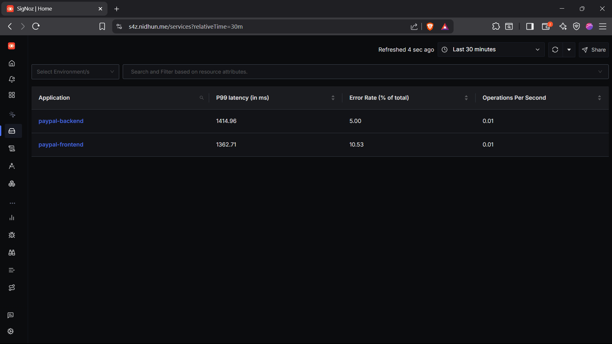
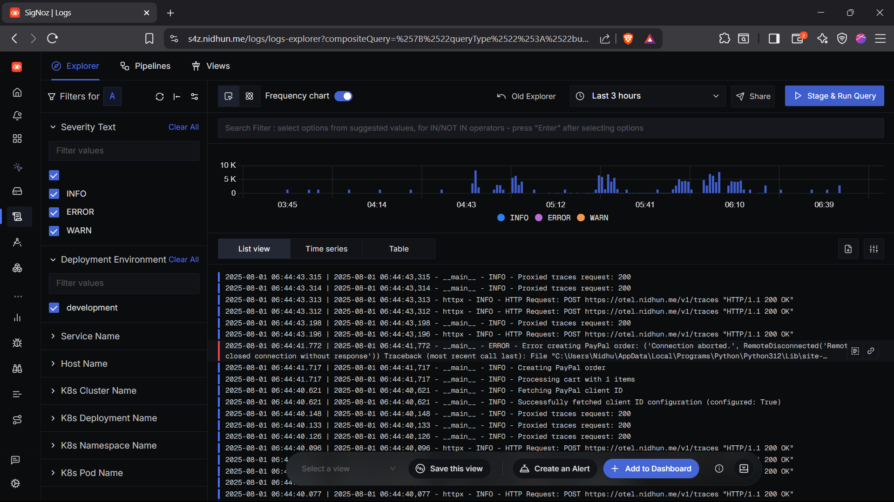
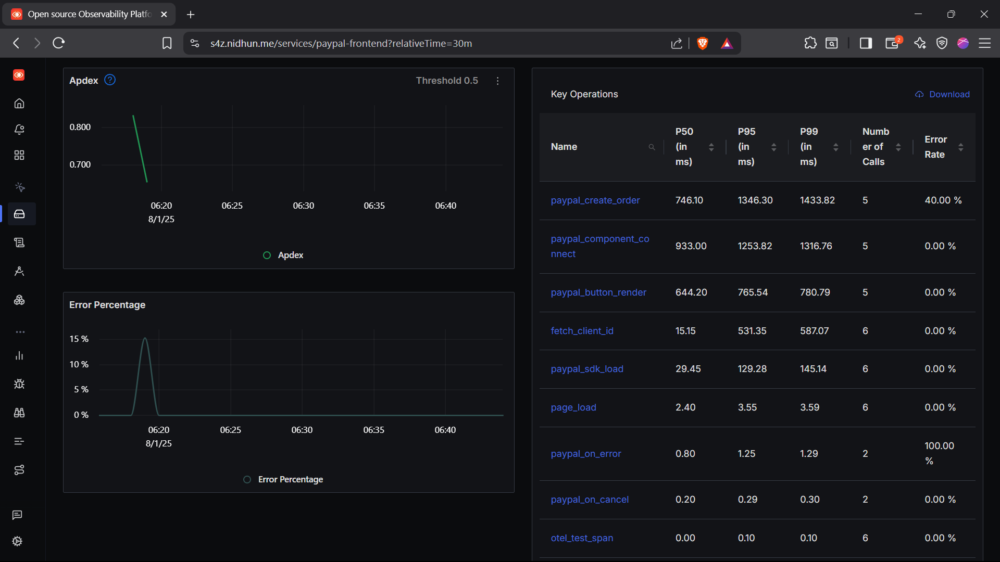

## PayPal - FastAPI Microfrontend

### Quickstart

```bash
# Install dependencies
pip install -r requirements.txt

# Copy and edit environment variables
cp .env.example .env
# Edit .env to set your PayPal and OTel credentials

# Run the server
python app.py
```

### Environment Setup
- Copy `.env.example` to `.env` and fill in:
  - `PAYPAL_CLIENT_ID` and `PAYPAL_CLIENT_SECRET`
  - `OTEL_ENDPOINT` (your OpenTelemetry collector endpoint)
- Example:
  ```env
  PAYPAL_CLIENT_ID=your-paypal-client-id
  PAYPAL_CLIENT_SECRET=your-paypal-client-secret
  OTEL_ENDPOINT=https://otel.example.me
  ```

### Features
- Microfrontend architecture with markdown-powered docs
- PayPal payment integration
- Real-time date/time display
- OpenTelemetry tracing and metrics

### Screenshots

### Services







